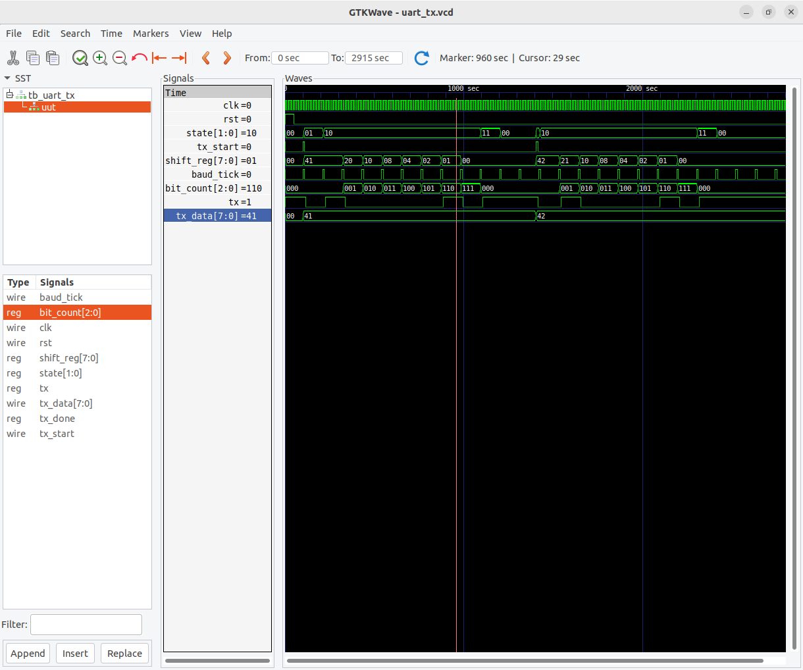
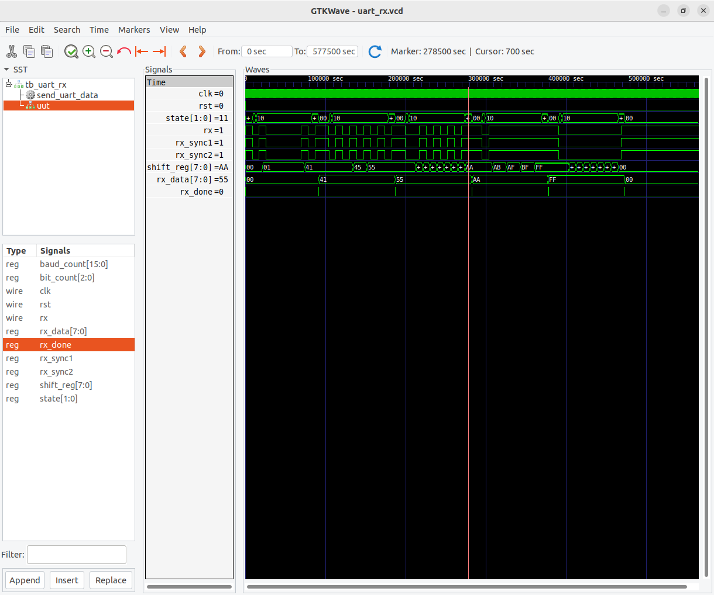
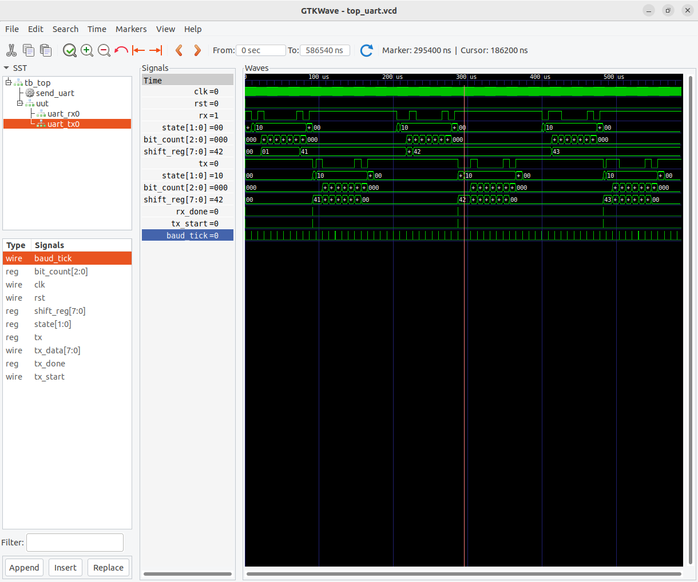
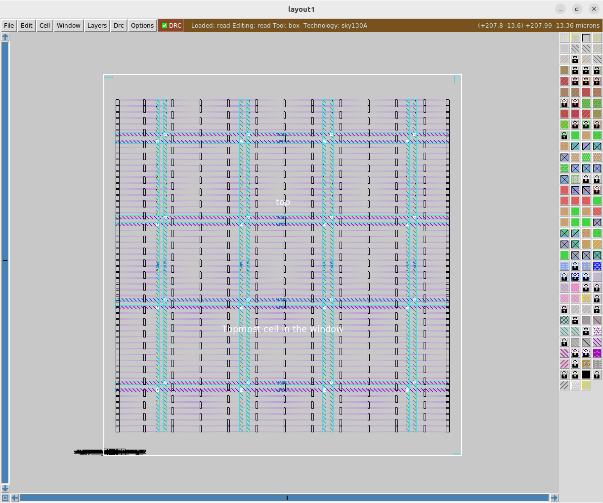
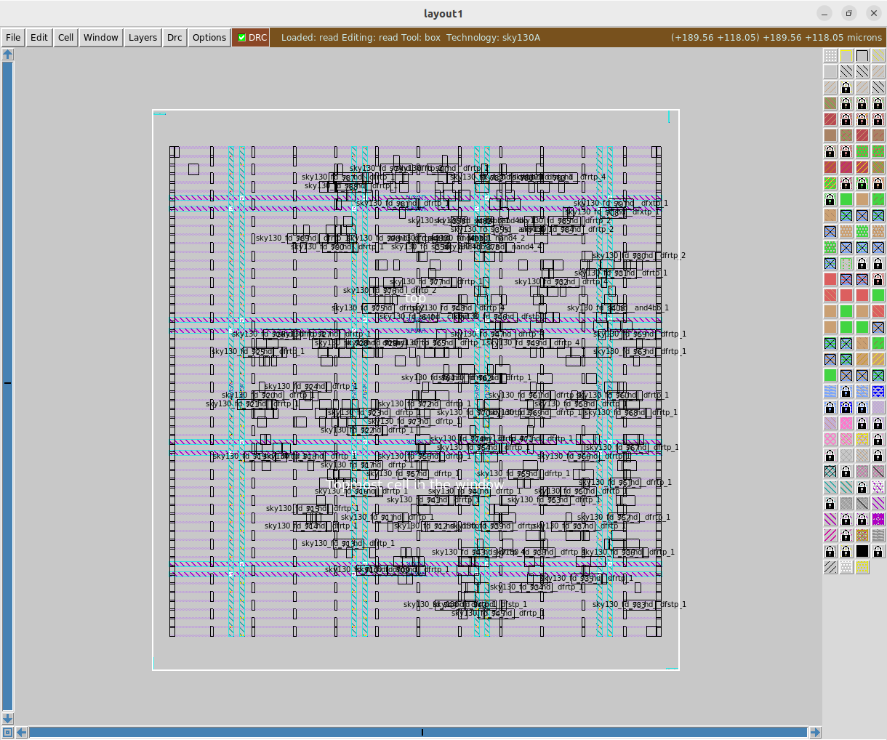
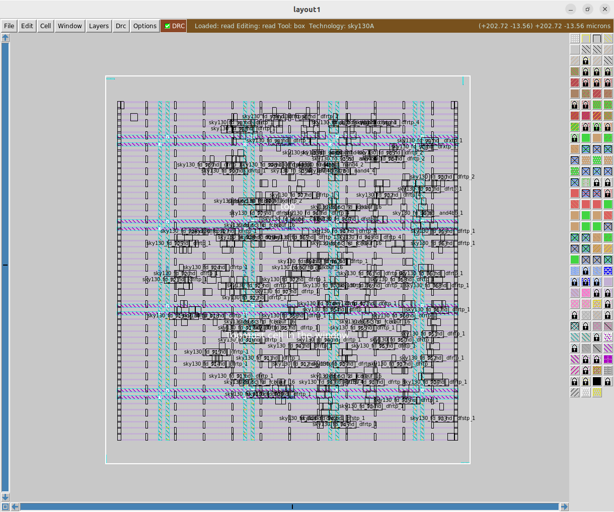
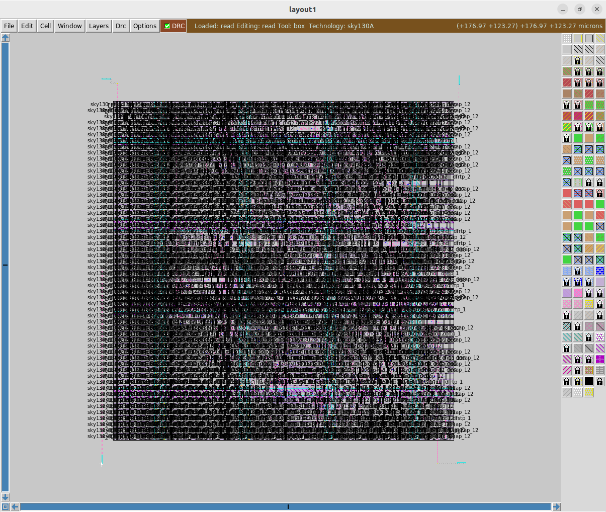

# UART Controller – RTL to GDSII Implementation

A complete UART (Universal Asynchronous Receiver Transmitter) Controller designed in Verilog HDL and implemented through the OpenLane RTL-to-GDSII flow using the SKY130 PDK.

The design consists of UART Receiver (RX), UART Transmitter (TX), and a top-level loopback controller that receives serial data and retransmits it.

---

## Project Overview

### Features

- UART Receiver (RX)
- UART Transmitter (TX)
- Baud Rate Generator
- Loopback Controller
- RTL Simulation using Icarus Verilog
- Waveform Verification using GTKWave
- RTL-to-GDSII implementation using OpenLane
- Timing Closure Achieved
- DRC Clean Layout

---

## Architecture

```

+-------------+
| UART RX |
+------+------+
|
v
+-------------+
| Loopback |
| Controller |
+------+------+
|
v
+-------------+
| UART TX |
+-------------+

```

The receiver captures incoming serial data, converts it to parallel format, and passes it to the loopback controller. The loopback controller triggers the transmitter to send the received byte back through the TX line.

---

## Directory Structure

```text
uart_controller
│
├── img
│   ├── cts.png
│   ├── floorplan.png
│   ├── placement.png
│   ├── routing.png
│   ├── top_waveform.png
│   ├── uart_rx_waveform.png
│   └── uart_tx_waveform.png
│
├── README.md
│
├── src
│   ├── top.v
│   ├── uart_rx.v
│   └── uart_tx.v
│
└── tb
    ├── tb_top.v
    ├── tb_uart_rx.v
    └── tb_uart_tx.v
```

---

# RTL Modules

## uart_rx.v

UART Receiver FSM:

- IDLE
- START
- DATA
- STOP

Functions:

- Detect start bit
- Sample incoming serial data
- Assemble received byte
- Assert `rx_done`

---

## uart_tx.v

UART Transmitter FSM:

- IDLE
- START
- DATA
- STOP

Functions:

- Generate UART frame
- Shift out data bits
- Generate stop bit
- Assert `tx_done`

---

## top.v

Top-level integration module containing:

- Baud Tick Generator
- UART RX
- UART TX
- Loopback Controller

Operation:

1. Receive serial byte
2. Store received data
3. Trigger transmitter
4. Retransmit same byte

---

# Simulation

## UART TX Waveform



Verified:

- Start bit generation
- Data transmission (LSB first)
- Stop bit generation
- TX Done pulse

---

## UART RX Waveform



Verified:

- Start bit detection
- Mid-bit sampling
- Byte reconstruction
- RX Done pulse

---

## Top Module Loopback Verification



Loopback test performed using:

| Input Character | ASCII | Result |
|---------------|-------|---------|
| A | 0x41 | PASS |
| B | 0x42 | PASS |
| C | 0x43 | PASS |

Console Output:

```text
Sending A (0x41)
PASS: Expected=41 Received=41

Sending B (0x42)
PASS: Expected=42 Received=42

Sending C (0x43)
PASS: Expected=43 Received=43

```

---

# RTL-to-GDSII Flow

Implemented using OpenLane and SKY130 PDK.

Flow Stages:

1. RTL Design
2. Synthesis
3. Floorplanning
4. Placement
5. Clock Tree Synthesis
6. Routing
7. Signoff

---

# Synthesis Results

| Metric | Value |
|----------|----------|
| Total Cells | 438 |
| Total Wires | 441 |
| D Flip-Flops | 84 |
| Cell Area | 4704.512 µm² |
| Die Area | 10000 µm² |
| Utilization | 47.04% |
| Total Power | 803 µW |
| WNS | 0.00 ns |
| TNS | 0.00 ns |
| Worst Setup Slack | 7.06 ns |
| Worst Hold Slack | 0.08 ns |

---

# Floorplan



| Metric | Value |
|----------|----------|
| Die Width | 164.41 µm |
| Die Height | 175.13 µm |
| Endcaps | 112 |
| Tap Cells | 319 |
| Voltage Sources | 1 |

---

# Placement



### Global Placement

| Metric | Value |
|----------|----------|
| Design Area | 5104 µm² |
| Utilization | 22% |
| Routing Overflow | 0 |
| Worst Setup Slack | 7.06 ns |
| Worst Hold Slack | 0.08 ns |

### Detailed Placement

| Metric | Value |
|----------|----------|
| Design Area | 4802 µm² |
| Utilization | 21% |
| Worst Setup Slack | 7.00 ns |
| Worst Hold Slack | 0.08 ns |

---

# Clock Tree Synthesis (CTS)



| Metric | Value |
|----------|----------|
| Clock Topology | H-Tree |
| Clock Roots | 1 |
| Clock Sinks | 84 |
| Clock Buffers Inserted | 9 |
| Clock Skew | 0.03 ns |
| Worst Setup Slack | 6.57 ns |
| Worst Hold Slack | 0.06 ns |

### Post-CTS Optimization

| Metric | Value |
|----------|----------|
| Hold Violating Endpoints | 55 |
| Hold Buffers Added | 62 |
| Design Area | 5648 µm² |
| Utilization | 24% |

---

# Routing



## Global Routing

| Metric | Value |
|----------|----------|
| Routed Nets | 517 |
| Total Wirelength | 16884 µm |
| Total Vias | 2129 |
| Congestion Overflow | 0 |
| Antenna Violations | 0 |

## Detailed Routing

| Metric | Value |
|----------|----------|
| Routing Iterations | 4 |
| Initial Violations | 182 |
| Final Violations | 0 |
| Total Wire Length | 9849 µm |
| Total Vias | 3083 |
| Routing Status | DRC Clean |

---

# Signoff Results

| Metric | Value |
|----------|----------|
| TNS | 0.00 ns |
| WNS | 0.00 ns |
| Worst Setup Slack | 6.70 ns |
| Worst Hold Slack | 0.28 ns |
| Clock Skew | 0.03 ns |
| Routing Violations | 0 |
| Congestion Overflow | 0 |
| Antenna Violations | 0 |
| Design Area | 5677 µm² |
| Utilization | 24% |
| Total Power | 1.13 mW |

---

# Final Summary

| Parameter | Value |
|------------|--------|
| Technology | SKY130A |
| RTL Language | Verilog HDL |
| Total Cells | 438 |
| Flip-Flops | 84 |
| Final Area | 5677 µm² |
| Utilization | 24% |
| Clock Frequency | 100 MHz |
| Worst Setup Slack | 6.70 ns |
| Worst Hold Slack | 0.28 ns |
| Total Power | 1.13 mW |
| DRC Violations | 0 |
| Antenna Violations | 0 |
| Timing Closure | Achieved |

---

## Tools Used

- Verilog HDL
- Icarus Verilog
- GTKWave
- OpenLane
- OpenROAD
- Yosys
- Magic
- Netgen
- SKY130 PDK

---

## Author

**Prem Arun P**

Electronics and Communication Engineering  
Madras Institute of Technology, Anna University


